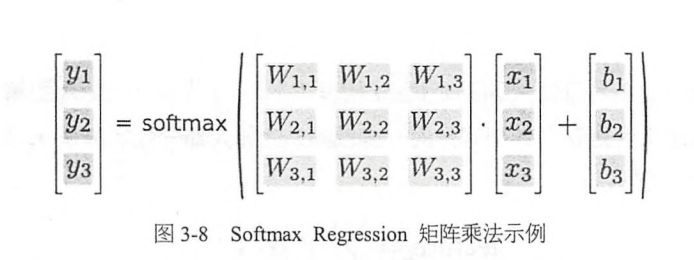

[TOC]

# TensoFlow 实战

## 1、TensorFlow基础

1. 核心概念

   TensorFlow 中的计算可以表示为一个有向图（directed  graph），或者计算图（computation graph），其中每一个运算操作（operation）将作为一个节点（node），节点与节点之间的连接称为边（edge）。

   在计算图的边中流动（flow）的数据被称为张量（tensor）。

   Session 是用户使用TensorFlow 时的交互式接口。可通过Sesssion 的 Extend 方法添加新的节点和边，用以创建计算图，然后通过 Session.run() 执行计算图。

2. 实现原理

## 2、TensorFlow 第一步

#### TensorFlow 实现 Softmax Regression 识别手写数字

特征公式（i 代表第 i 类， j 代表一张图片的第 j 个像素）：
$$
feature_i = \sum_{j}{W_{i,j} x_j + b_i}
$$
对所有特征计算 softmax，就是都计算一个 exp 函数，然后再进行标准化（让所有类别输出的概率值和为 1）特征值越大的类，最后输出的概率也越大；反之，特征值越小的类，输出的概率也越小：
$$
softmax(x) = normalize(exp(x)) \\[4ex]
softmax(x) = \frac{exp(x_i)}{\sum_{j}{exp(x_j)}}
$$

Cross-entropy 的定义（y 是预测的概率分布， $y^{\prime}$ 是真实的概率分布（即 Label 的 one-hot 编码））：
$$
H_{y^{\prime}(y) = - \sum_{i}{y_i^{\prime} \log(y_i)}}
$$
没有隐藏层的神经网络的整个流程：

- 定义算法公式，也就是神经网络 forward 时的计算
- 定义 loss，选定优化器，并指定优化器优化 loss
- 迭代地对数据进行训练
- 在测试集或验证集上对准确率进行评测

## 3、TensorFlow 实现自编码器及多层感知机

### 自编码器

自编码器（AutoEncoder）：即可以使用自身的高阶特征编码自己。自编码器其实也是一种神经网络，它的输入和输出是一致的，它借助稀疏编码（Sparse Coding）的思想，目标是使用稀疏的一些高阶特征重新组合来重构自己。

自编码器：

- 去噪自编码器：去噪声，并保证隐含层节点小于输入层节点
- Masking Noise自编码器：将高斯噪声改为随机遮挡噪声
- Variational AutoEncoder（VAE）：VAE 对中间点的分布有强假设，拥有额外的损失项，且会使用特殊的 SGVB（Stochastic Gradient Variational Bayes）算法进行训练

Xavier 初始化器会根据某一层网络的输入、输出节点数量自动调整最合适的分布。如果深度学习模型的权重初始化得太小，信号将在每层间传递时主键缩小而难以产生作用，如果权重初始化得太大，信号将在每层间传递时逐渐放大并导致发散和失效。而Xavier 就是让权重满足 0 均值，同时方差为 $\frac{2}{n_{in} + n_{out}}$ 。

### 多层感知机

**过拟合：** 是指模型预测率在训练集上升高，但是在测试集上反而下降了，这通常意味着泛化性不好，模型只是记忆了当前数据的特征，不具备推广能力。

在神经网络中，经常出现参数比数据还要多的情况，这就非常容易出现过拟合。Dropout 可以有效的解决这一问题，即将神经网络某一层的输出节点数据随机丢弃一部分。

参数难调是神经网络的另一大痛点，尤其是 SGD 参数，对SGD 设置不通的学习率，最后得到的结果可能差异巨大。神经网络通常不是一个凸优化的问题，它处处充满了局部最优解。因此就有像 Adagrad、Adam、Adadelta 等自适应的方法可以减轻调试参数的负担。

**梯度弥散（Gradient Vanishment）：** 当神经网络层数较多时，Sigmod 函数在反向转播中梯度值会逐渐减小，经过多层的传递后会呈指数级急剧减小，因此梯度值在传递到前面几层时就变得非常小了。

**ReLU** 是一个简单的非线性函数 $y = max(0, x)$ ，ReLU 可以很好的传递梯度，经过多层的反向传播，梯度依旧不会大幅缩小。

在实践过程中将隐藏层的激活函数从 Sigmod 替换为 ReLU 都可以带来训练速度和模型准确率的提升。当然神经网络的输出层一般都还是 Sigmod 函数，因为它最接近概率输出分布。

## 4、TensorFlow 实现卷积神经网络（Convolutional Neural Network，CNN）

### 卷积神经网络简介

一般的卷积神经网络由多个卷积层构成，每个卷积层通常会进行以下操作：

- 图像通过多个不同的卷积核的滤波，并加偏置，提取局部特征，每一个卷积核会映射出一个新的 2D 图像
- 将新的 2D 图像进行非线性的激活函数处理
- 对激活函数的结果再进行池化操作（降采样），保留最显著的特征，并提升模型的畸变容忍能力

