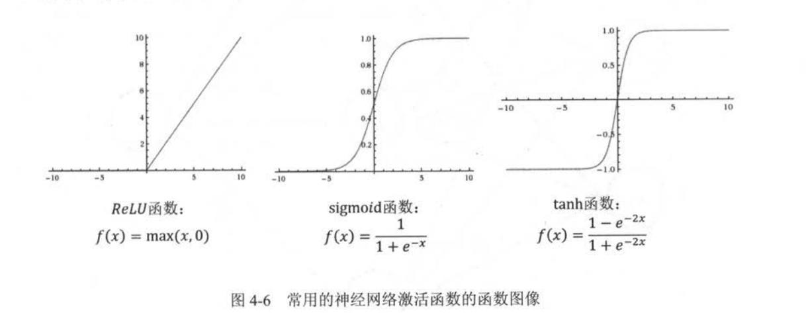

[TOC]

# TensorFlow 实战 Google 深度学习框架

## 1、TensorFlow 入门

### 1.1 TensorFlow 计算模型-计算图

Tensor - 张量

Flow - 流动，计算模型

在 TensorFlow 中，系统会自动维护一个默认的计算图

```python
# 默认的计算图
graph = tf.get_default_graph()
print(graph)
# 新的计算图
g_1 = tf.Graph()
    with g_1.as_default():
        v = tf.constant(1.0)
    with tf.Session(graph=g_1) as sess:
        v_value = sess.run(v)
        print(v_value)
        print(tf.get_default_graph())
```

​	在一个计算图中，可以通过集合（collection）来管理不通类别的资源。例如通过 tf.add_to_collection 可以将资源加入一个或多个集合中，然后通过 tf.get_collection 过去一个集合里面所有的资源。

TensorFlow 也自动管理了一些集合：

| 集合名称                              | 集合内容                         | 使用场景                 |
| ------------------------------------- | -------------------------------- | ------------------------ |
| tf.GraphKeys.VARIABLES                | 所有变量                         | 持久化模型               |
| tf.GraphKeys.TRAINABLE_VARIABLES      | 可学习的变量（神经网络中的参数） | 模型训练，生产可视化内容 |
| tf.GraphKeys.SUMMARIES                | 日志生成相关的张量               | 计算可视化               |
| tf.GraphKeys.QUEUE_RUNNERS            | 处理输入的QueueRunner            | 输入处理                 |
| tf.GraphKeys.MOVING_AVERAGE_VARIABLES | 所有计算了滑动平均值的变量       | 计算变量的滑动平均值     |

### 1.2 TensorFlow 数据模型-张量

​	**张量（tensor）** ，在TensorFlow 中的实现并不是直接采用数组的形式，它只是对TensorFlow 中运算结果的引用。在张量中并没有真正保存数字，它保存的是如何得到这些数字的计算过程。

张量的三个属性：名字（name）、维度（shape）和 类型（type）

张量的名字不仅是张量的唯一标识符，同样也给出了张量是如何计算的。

TensorFlow 支持14 中类型：实数（tf.float32、tf.float64）、整数（tf.int8、tf.int16、tf.int32、tf.int64、tf.uint8）和复数（tf.complex64、tf.complex128）

张量主要用于：

- 对中间计算结果的引用
- 当计算图构造完成之后，张量可以用来获得计算结果

### 1.3 TensorFlow 运行模型-会话

​	**会话（Session）** ，拥有并管理 TensorFlow 程序运行时的所有资源，所有计算完成后需要关闭会话以回收资源。

TensorFlow 提供了一种在交互式环境下直接构建默认会话的函数 tf.InteractiveSession ，这个函数会自动将生成的会话注册为默认会话。

tf.ConfigProto 用来配置生成的会话，通过 tf.ConfigProto 可以配置类似并行的线程数、GPU 分配策略、运算超时时间等参数。

tf.ConfigProto 常用参数：

- allow_soft_placement，为 True 时，在以下任一条件成立时，GPU 上的计算可以放到CPU 上运行：
  - 运算无法在GPU 上执行
  - 没有GPU 资源
  - 运算输入包含对 CPU 计算结果的应用
- log_device_placement，为 True 时，日志记录将会记录每个节点被安排在哪个设备上以方便调试

### 1.4 TensorFlow 实现神经网络

在 TensorFlow 中，变量（tf.Variable）的作用就是保存和更新神经网络中的参数。

TensorFlow 随机数生成器：

| 函数名              | 随机数分布                                                  | 主要参数                                |
| ------------------- | ----------------------------------------------------------- | --------------------------------------- |
| tf.random_normal    | 正态分布                                                    | 平均值、标准差、取值类型                |
| tf.truncated_normal | 正态分布，但如果随机出来的值超过 2 个标准差，将会被重新随机 | 平均值、标准差、取值类型                |
| tf.random_uniform   | 均匀分布                                                    | 最小、最大取值，取值类型                |
| tf.random_gamma     | Gamma 分布                                                  | 形状参数 alpha、尺度参数 beta、取值类型 |

TensorFlow 常数生成函数：

| 函数名      | 功能                         | 样例                                            |
| ----------- | ---------------------------- | ----------------------------------------------- |
| tf.zeros    | 产生全 0  的数组             | tf.zero([2, 3], int32)->[[0, 0, 0,], [0, 0, 0]] |
| tf.ones     | 产生全 1 的数组              | tf.ones([2, 3], int32)->[[1, 1, 1], [1, 1, 1]]  |
| tf.fill     | 产生一个全部为给定数字的数组 | tf.fill([2, 3],  9)->[[9, 9, 9], [9, 9, 9]]     |
| tf.constant | 产生一个给定值的常量         | tf.constant([1, 2, 3])->[1, 2, 3]               |

**监督学习的思想** 就是在已知的答案的标注数据集上，模型给出的预测要尽量接近真实的答案。通过调整神经网络中的参数对训练数据进行拟合，可以使得模型对未知的样本提供预测的能力。

在神经网络优化算法中，最常用的方法是反向传播算法（backpropagataion）：


**损失函数：** 计算当前预测值与真实值之间的差距

## 2、深层神经网络

### 2.1 深度学习与深层神经网络

激活函数实现去线性化：


常用的激活函数：



### 2.2 损失函数的定义

**交叉熵（cross entropy）** ，用于描述两个概率之间的距离。

给定两个概率分布 p 和 q，通过 q 来标识 p 的交叉熵为：
$$
H(p, q) = -\sum_{x}{p(x)\log{q(x)}}
$$
交叉熵描述的是两个概率之间的距离，然而神经网络的输出不一定是一个概率分布，Softmax 回归可以将神经网络前向传播的结果变成概率分布。

Softmax 回归的神经网络结构图：


假设神经网络的原始输出为 $y_i, y_2, \cdots, y_n$ ，那么经过Softmax 回归处理之后的输出为：
$$
softmax(y)_i = y_i^{\prime} = \frac{e^{y_i}}{\sum_{j = 1}^{n}{e^{y_i}}}
$$
当交叉熵作为神经网络的损失函数时，p 代表的是正确答案，q 代表的是预测值。交叉熵代表两个概率分布的距离，交叉熵越小，两个概率分布越接近。

```python
# 交叉熵实现
cross_entropy = -tf.reduce_mean(y_ * tf.log(tf.clip_by_value(y, 1e-10, 1.0)))
```

tf.clip_by_value 函数可以将一个张量中的数值限制在一个范围内，避免一些错误运算（$\log0$） 

\* 与 tf.matmul 的区别：\* 是元素间直接相乘，tf.matmul 是矩阵乘法

因为交叉熵一般会与 softmax 回归一起使用，TensorFlow 对这两个功能进行了统一封装 tf.nn.softmax_cross_entropy_with_logits ，对于只有一个正确答案的分类问题中，TensorFlow 提供了 tf.nn.sparse_softmax_cross_entropy_with_logits 来进一步加速计算过程。

对于回归问题，最常用的损失函数是 **均方误差（MSE，mean squared error）** ：
$$
MSE(y, y^{\prime}) = \frac{\sum_{i = 1}^{n}{(y_i - y_i^{\prime})^2}}{n}
$$
其中 $y_i$ 为一个 batch 中第 i 个数据的正确答案，$y_i^{\prime}$ 为神经网络给出的预测值。

### 2.3 神经网络优化算法

- 反向传播算法（backpropagation）
- 梯度下降算法（gradient decent）

神经网络的优化过程分为两个阶段：

- 先通过前向传播算法计算得到预测值，并将预测值和真实值做对比得出两者之间的距离
- 通过反向传播算法计算损失函数对每一个参数的梯度，再根据梯度和学习率使用梯度下降算法更新每一个参数。

梯度下降算法一个问题是并不能保证被优化的函数达到全局最优解，在训练神经网络时，参数的初始值会很大程度影响最后得到的结果。只有损失函数为凸函数时，梯度下降算法才能保证达到全局最优解。另一个问题是计算时间太长，为了加速训练过程，可以使用随机梯度下降算法（stochastic gradient descent），这个算法优化的不是全部数据上的损失函数，而是随机优化某一条数据上的损失函数，但在一条数据上损失函数的更小并不代表在全部数据上损失函数更小，所以随机梯度下降算法优化的神经网络甚至无法达到局部最优解。

在实际应用中每次只计算一小部分（一个batch）训练数据的损失函数，每次使用一个 batch 可以减小收敛所需的迭代次数，同时可以使收敛到的结果更加接近梯度下降的效果。

### 2.4 神经网络进一步优化

- 学习率（leaning rate）的设置

  学习率过大，将不会收敛到一个极小值，消息率过小，会降低优化速度

  TensorFlow 的指数衰减法：tf.train.exponential_decay 它实现了以下代码的功能：

  ```python
  decay_leaning_rate = \
  	leaning_rate * decay_rate ^ (global_step / decay_steps)
  ```

  


- 过拟合问题

  过拟合指的是当一个模型过于复杂之后，它可以很好地“记忆”每一个训练数据集中随机噪音的部分而忘记了要去“学习”训练数据集中通用的趋势。

  

  为了避免过拟合的问题，常用的方法是正则化（regularization）。正则化的思想就是在损失函数中加入刻画模型复杂度的指标。假设损失函数为 $J(\theta)$ ，那么在优化时不是直接优化 $J(\theta)$ ，而是优化 $J(\theta) + \lambda R( w)$ 。其中 $R(w)$ 刻画的是模型的复杂度，$\lambda$ 表示模型复杂损失在总损失中的比例。这里的 $\theta$ 表示的是一个神经网络中所有的参数，包括权重 $w$ 和偏置项 $b$ 。模型复杂度一般只由权重 $w$ 决定。

  常用的刻画模型复杂度的函数 $R(w)$ 有两种：

  - L1 正则化
    $$
    R(w) = \sum_{i}{|w_i|}
    $$
    

    
  - L2 正则化
    $$
    R(w) = \sum_{i}{w_i^2}
    $$
    

  正则化的基本思想就是希望通过限制权重的大小，使得模型不能任意拟合训练数据中的随机噪音。L1 与 L2 的区别是：L1 正则化会让参数变得稀疏，L2不会。所谓参数变得稀疏是指会有更多的参数变为 0，这样可以达到类似选取特征的功能。L2不会让参数变得稀疏的原因是因为当参数很小时，这个参数的平方基本上就可以忽略不计了，于是模型不会进一步将这个参数调整为 0。其次，L1 的计算公式不可导，L2 公式可导，

- 滑动平均模型

  滑动平均模型在一定程度上可以提高最终模型在测试数据上的表现，TensorFlow 提供了 tf.train.ExponentialMovingAverage 来实现滑动平均模型。ExponentialMovingAverage 对每一个变量维护了一个影子变量（shadow_variable），每次变量更新时，影子变量的值会更新为：

  shadow_variable = decay * shadow_variable + (1-decay) * variable，ExponentialMovingAverage 还提供了 num_updates 参数来动态设置 decay 的大小。如果在 ExponentialMovingAverage 初始化时提供了 num_updates 参数，那么每次使用的衰减率为：
  $$
  \min\lbrace
  decay, \; \frac{1 + num\_updates}{10 + num\_updates}
  \rbrace
  $$
  